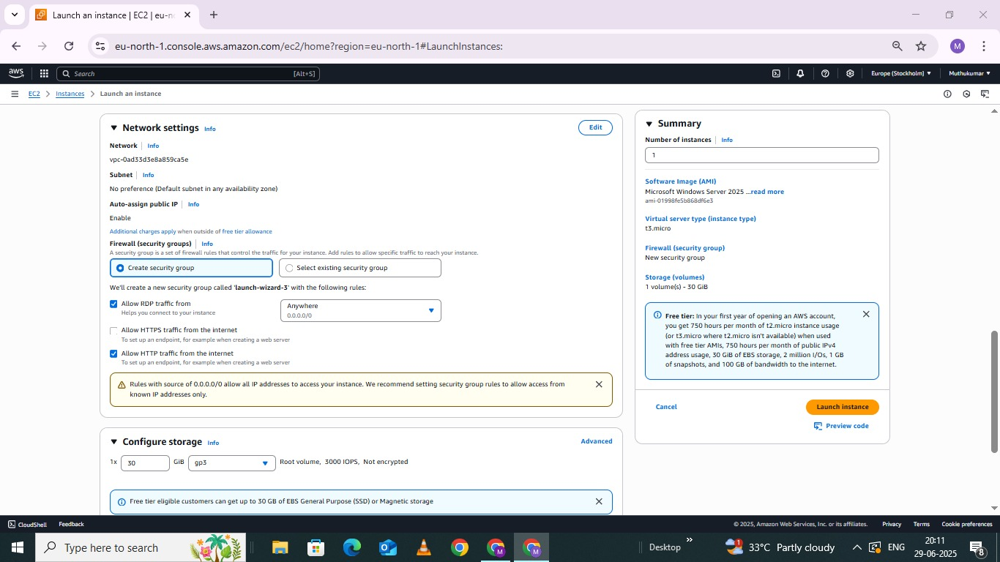
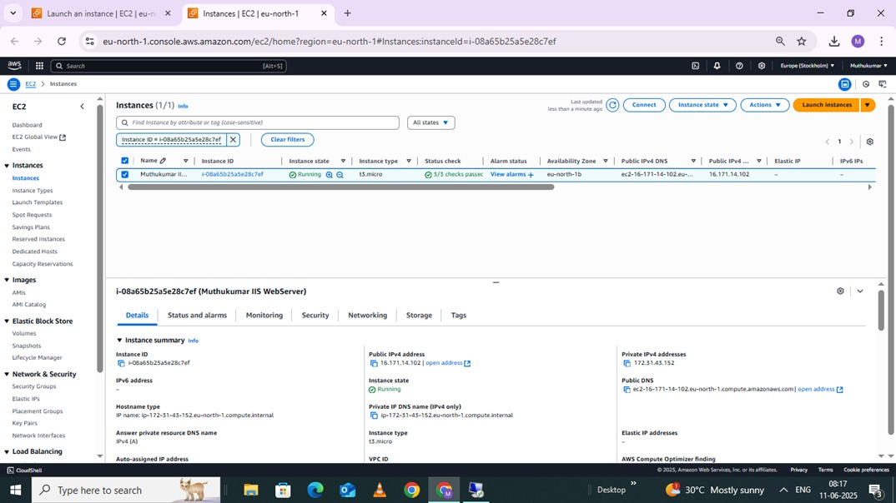
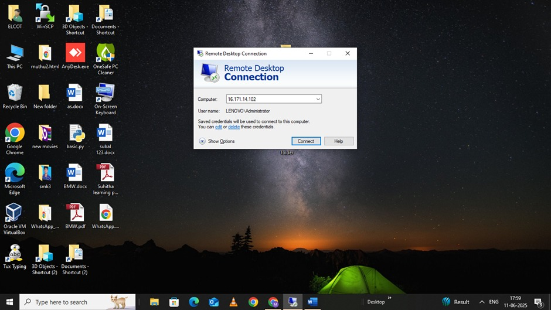
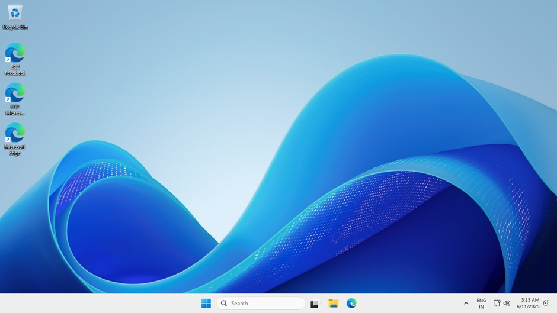
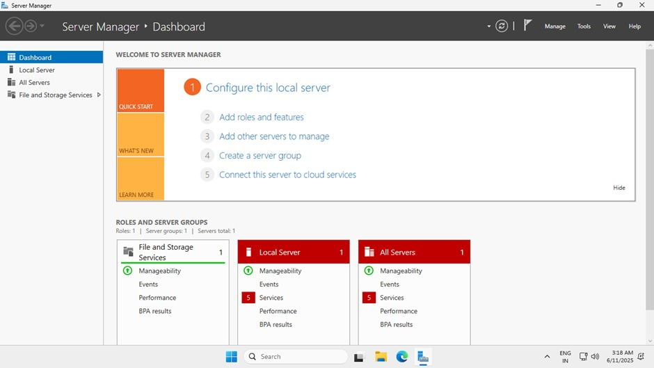
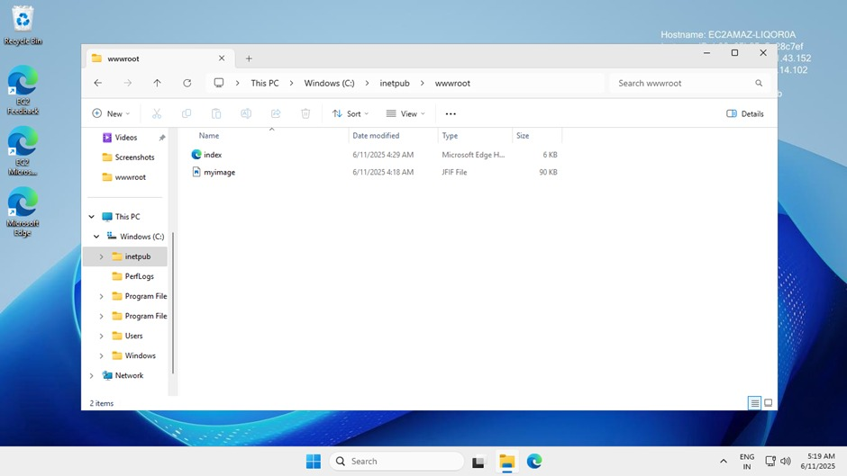
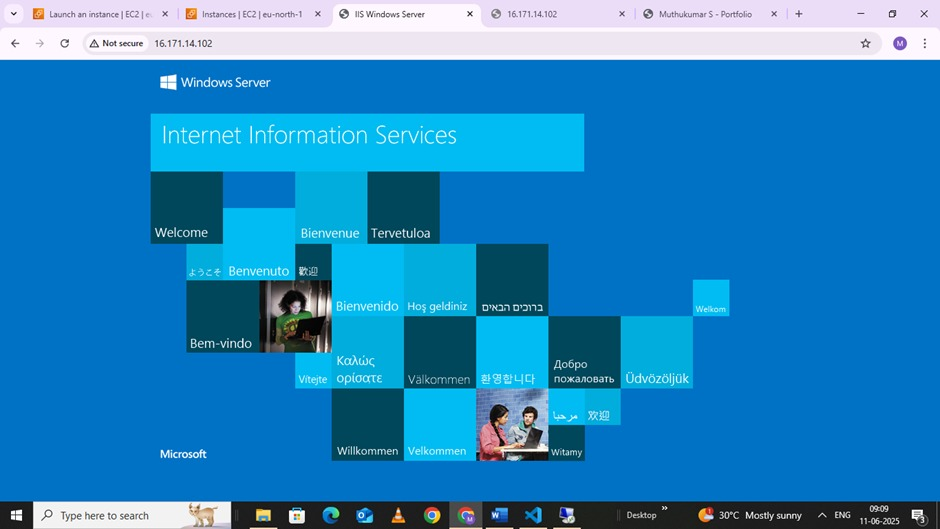
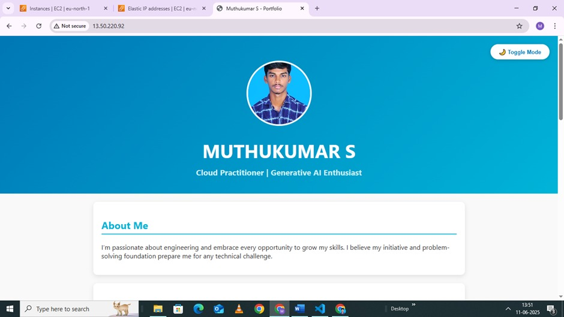
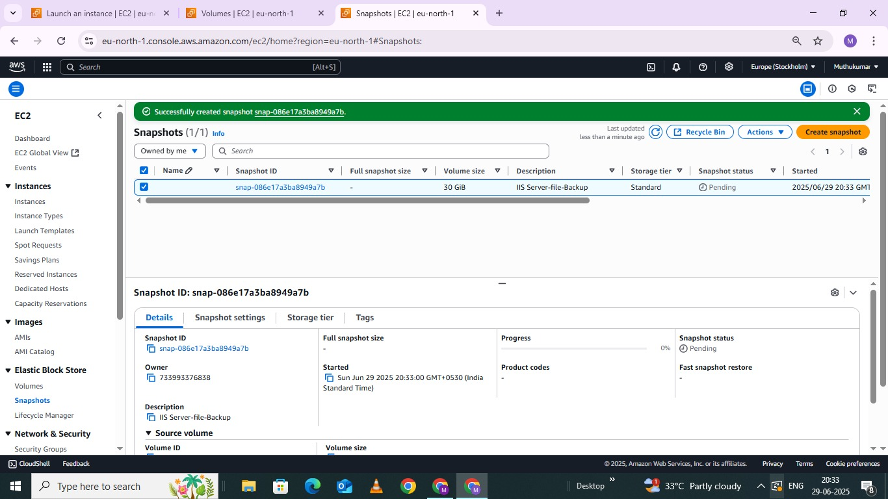

# 🌐 Hosting a Static Website on AWS EC2 using IIS (Windows Server)

## 🎯 Objective
To host a static HTML website using IIS (Internet Information Services) on a Windows Server launched through AWS EC2. The site should be publicly accessible via a static Elastic IP, with practical cost-saving measures applied.

---

## 🛠️ Tools & Services Used
- 🖥️ AWS EC2 (Windows Server 2019)
- 🌐 IIS (Internet Information Services)
- 📶 Elastic IP
- 💻 Remote Desktop Protocol (RDP)
- 💾 EBS Snapshot
- 🗂️ Custom HTML Files

---

## 🧭 Deployment Steps

### 1️⃣ Launch EC2 Instance
- Launched a Windows Server 2019 EC2 instance using AWS Free Tier.
- Configured RDP and HTTP access in the security group.

  

---

### 2️⃣ Connect via RDP
- Connected to the EC2 instance using Remote Desktop.
- Verified access and server readiness.

  

---

### 3️⃣ Install IIS
- Used Server Manager > Add Roles and Features to install IIS.
- Confirmed setup by viewing IIS welcome page.

---

### 4️⃣ Host Website
- Replaced the default index.html file in C:\inetpub\wwwroot with custom HTML.
- Viewed the hosted site inside the server browser.

  

---

### 5️⃣ Attach Elastic IP
- Allocated and attached an Elastic IP to the instance *after confirming site works internally*.
- Website is now publicly visible using that IP.

> ℹ️ Since the Elastic IP was attached to a running instance, there was no additional charge.

  

---

### 6️⃣ Backup via Snapshot
- Took an EBS snapshot of the volume to preserve the IIS + website setup.
- Deleted the original volume afterward to stop storage charges.

> 💡 I chose snapshot instead of detaching the volume because even if we detach the volume, AWS still charges full EBS price. But snapshot stores only the used data and costs less. I also didn’t want to lose my IIS setup and website files — so snapshot was the safest and cheapest backup for me.

---

## 🧠 Snapshot vs AMI – Why Snapshot Was Right for Me

| Feature              | Snapshot 📸                            | AMI 🧪                                           |
|----------------------|----------------------------------------|--------------------------------------------------|
| What it backs up     | Just the EBS volume (files, IIS setup) | Entire instance (OS + config + storage)          |
| Use case             | Data backup and recovery               | Recreating a new identical EC2 instance          |
| Cost efficiency      | More cost-effective                    | Slightly more storage + metadata overhead        |
| My goal              | Backup IIS + website files             | Not needed for full EC2 recreation               |

✅ Since I only needed to preserve the website and IIS configuration (not redeploy the full server), snapshot was the better choice.

---

## 📈 Project Outcome
- 🧩 Deployed and hosted a website on Windows Server EC2  
- 🌐 Made it publicly accessible with a static Elastic IP  
- 💾 Preserved the server state with snapshots to avoid cost  
- 📚 Learned practical AWS billing and backup decisions  
- ✅ Documented all steps clearly with visuals

---

## 👨‍💻 About Me  
*Name:* Muthukumar S  
*Qualification:* B.E. Mechanical Engineering  
*Status:* Fresher (2025 pass-out)  
*GitHub:* [github.com/Muthukumar15022004](https://github.com/Muthukumar15022004)

> 📸 More screenshots available in the /Screenshots folder of this repo 
